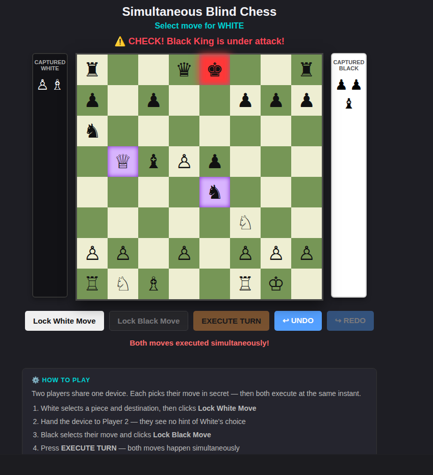

# ♟ Simultaneous Blind Chess

**A chess variant where both players move at the same instant — and can't see each other's choice.**

---

## Why this is different from standard chess

Standard chess alternates turns. This doesn't.

Both players secretly pick their move on the same device, lock it in, then press **Execute** — both pieces move at exactly the same time. That one change creates an entirely new game of psychology, prediction, and risk:

- You must **predict intent**, not just react to position
- Pieces can **collide** mid-board and annihilate each other
- Both kings can be **in check simultaneously**
- A king can actually be **physically captured**

---

## Original Rules

### Base: Standard chess
All standard piece movements, castling, promotion, check, checkmate, and stalemate apply — plus the four new rules below.

---

### 🟣 Purple Lock — No Repeat Moves
The piece you just moved is highlighted purple and **locked for one full turn**. You must move a different piece. This prevents any single piece from dominating every round and forces strategic variety.

---

### 💥 Collision — Same Square, Same Moment
If both players move to the same square simultaneously:

| Situation | Result |
|-----------|--------|
| Different piece values | Higher-value piece wins and stays |
| Same piece value | **Both pieces are destroyed** — square left empty |

| Piece | Value |
|-------|-------|
| ♙ Pawn | 1 |
| ♘ Knight | 3 |
| ♗ Bishop | 3 |
| ♖ Rook | 5 |
| ♕ Queen | 9 |
| ♔ King | 100 |

---

### ⚠️ Double Check — Both Kings Can Be Threatened at Once
Because moves are simultaneous, both kings can be in check at the same time. Each player must independently resolve their own king's danger. Moves that would leave your king exposed are **blocked** — they won't appear as valid options.

---

### 👑 King Capture — The Simultaneous Threat
Unlike standard chess, a king can be **physically captured** here because both pieces land at the same moment.

| Situation | Result |
|-----------|--------|
| Your king is captured | You lose |
| Both kings captured in same move | **Draw** |
| No legal moves + in check | Checkmate — you lose |
| No legal moves + not in check | Stalemate — Draw |

---

## How to Play

Two players share one device.

1. **White** selects a piece and destination, then clicks **Lock White Move**
2. Hand the device to Player 2 — they cannot see White's choice
3. **Black** selects their move and clicks **Lock Black Move**
4. Press **EXECUTE TURN** — both moves apply simultaneously
5. Repeat until the game ends

Use **↩ UNDO** and **↪ REDO** to review full turn history at any point.

---

## Run It

**No installation. No server. No dependencies.**

**Option A — Play online:**
👉 [https://malikaoo.github.io/simultaneous-blind-chess/](https://malikaoo.github.io/simultaneous-blind-chess/)

**Option B — Run locally:**
1. Download `index.html`
2. Open it in any modern browser (Chrome, Firefox, Safari, Edge)
3. That's it.

---

## About This Project

**Invented and built in 2025 by [Tarek Nasser].**

The combination of:
- Blind simultaneous move selection on a shared device
- The Purple Lock (no-repeat-move) rule
- Collision resolution by piece value

...is an original invention by the author.

---

## License

✅ Free for personal, non-commercial use  
❌ Commercial use requires written permission from the author

See [LICENSE](./LICENSE) for full terms.

---

Built with pure HTML, CSS, and JavaScript — no frameworks, no dependencies.

